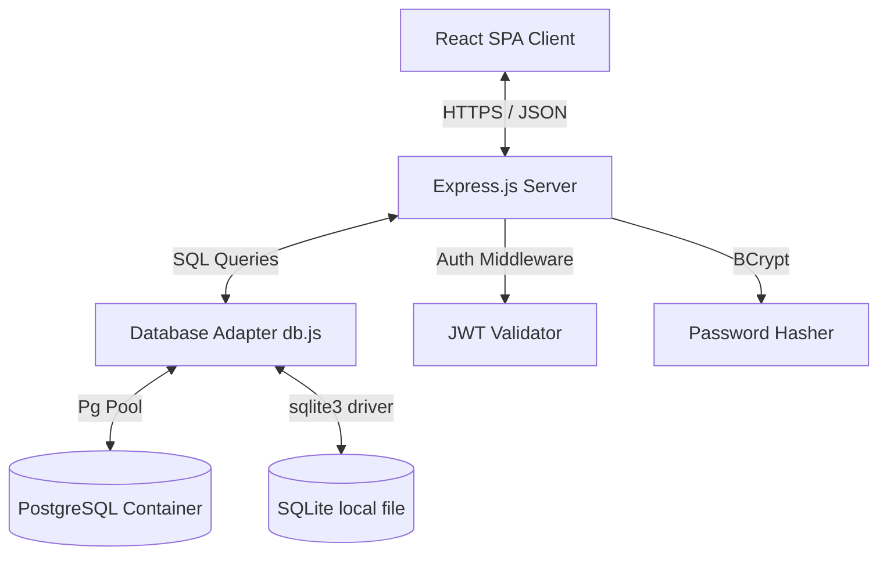
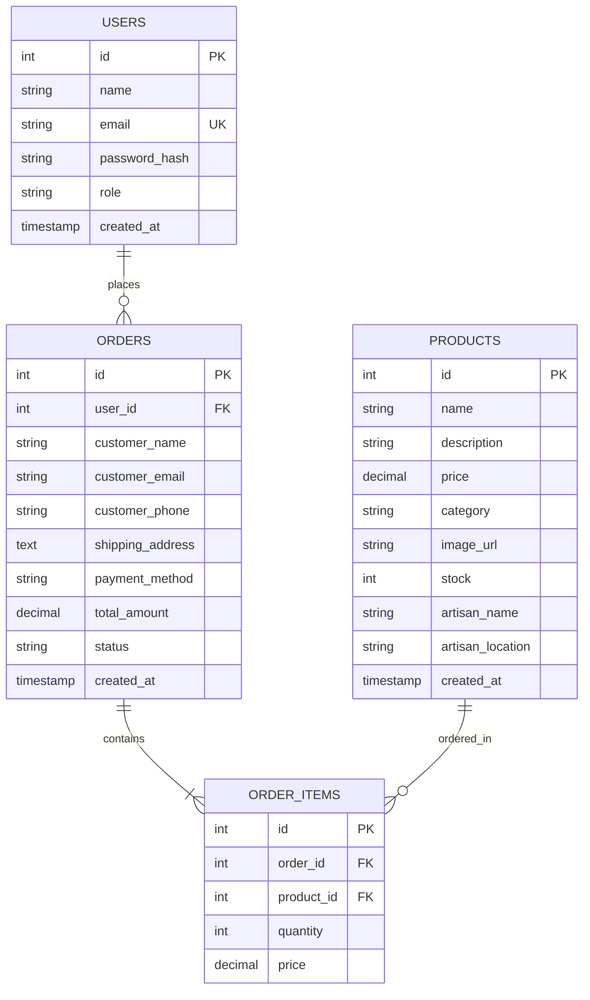

# Project Report: Ansu Sirleaf (Rwandan Handicrafts E-Commerce Marketplace)

**Course Code & Name**: EWA408510 – E-Commerce and Web Application  
**Assessment Type**: Individual Project (Final Examination)  
**Institution**: University of Lay Adventists of Kigali (UNILAK)  
**Academic Year**: 2025-2026  
**Instructor**: Eric Maniraguha  

---

## 1. Introduction
In recent years, Rwanda has experienced rapid digital transformation, driven by high mobile phone penetration and government policies fostering a cashless economy. E-commerce platforms represent a key channel for local businesses to expand. **Ansu Sirleaf** is a premium, web-based e-commerce platform designed to digitize the sales of authentic Rwandan handicrafts, including hand-woven baskets (Agaseke), Imigongo geometric paintings, clay pottery, and local wood carvings. By connecting rural artisan cooperatives directly to local and international consumers, the system preserves cultural heritage while providing sustainable, fair-trade income streams.

## 2. Problem Statement
Traditional handicraft cooperatives in Rwanda, especially those based in rural areas (such as Huye, Musanze, and Kirehe), face significant barriers to market entry:
* **Geographical Constraints**: Baskets and carvings are sold in local markets, limiting outreach to international tourists and urban shoppers in Kigali.
* **Payment Bottlenecks**: Global customers lack access to local Mobile Money networks (MTN MoMo, Airtel Money), and local cooperatives cannot easily process international card payments.
* **Inventory Mismanagement**: Baskets are hand-woven over several days or weeks, making inventory tracking vital to prevent overselling.
* **DevOps Deficiencies**: Many local web applications are deployed without containerized isolation or automated tests, resulting in downtime and security risks.

## 3. Project Objectives
The core objectives of the Ansu Sirleaf platform are to:
1. **Design a Responsive, Premium UI**: Showcase products with traditional Rwandan branding (such as Imigongo patterns) and mobile-friendly styling.
2. **Implement Relational Database Management**: Securely manage products, customer accounts, orders, and individual transaction items.
3. **Simulate Mobile Payments**: Offer validations for Rwandan phone prefixes (+250) and simulate MTN MoMo and credit card checkouts.
4. **Develop Admin Analytics**: Track revenue, average order value, category market share, and order fulfillment states.
5. **Establish DevOps Standard**: Build a multi-stage Dockerfile, coordinate containers via Docker Compose, and automate tests using GitHub Actions.

## 4. System Features
* **Product Catalog**: Paginated list of products featuring search queries, category sorting, and price ordering.
* **Shopping Basket**: A slide-out panel allowing quantity updates, real-time total updates, and strict checks against inventory stock limits.
* **Artisan Storytelling**: Individual product pages detail the biography of the local creator, their province, and the heritage significance of their craft.
* **Role-Based Authentication**: Custom sign-in and registration pages using salted password hashes and JWT token validations.
* **Payment Simulators**: Real-time push prompt simulations for Mobile Money and verification models for credit cards.
* **Fulfillment Admin Dashboard**: Graphical trackers displaying sales metrics, category distribution bars, and status dropdowns to change order status.

## 5. Technologies Used
* **Frontend**: React.js (Component-based UI), Lucide React (Vector icons), CSS Modules & Variables (Custom themes).
* **Backend**: Node.js, Express.js (REST API framework).
* **Database**: PostgreSQL (Production DB service) and SQLite (Local file-based system fallback).
* **Security**: Bcrypt.js (Password cryptography), JSONWebTokens (Session tokens).
* **Fulfillment/DevOps**: Docker, Docker Compose, GitHub Actions (CI/CD workflows), Node assert test runner.

## 6. System Architecture
The application employs an MVC API architecture coupled with a React Single Page Application (SPA):

The database adapter is configured to support dual modes: it reads connection variables, falling back automatically to SQLite if PostgreSQL variables are absent.

## 7. Database Design
The relational database holds four tables. The entity relations are modeled below:

## 8. Screenshots of the Application
*(The application interfaces can be inspected in the following image directories:)*
* **Homepage**: Hero banner featuring Kinyarwanda welcome greetings and featured categories.
* **Shop Catalog**: Filter controls, search matches, and artisan location indicators.
* **Fulfillment Panel**: Admin metrics cards and status update controls.
* **Order Invoice**: Success checkout message with tracking indices and delivery estimates.

## 9. GitHub Repository Link
* **Repository URL**: [https://github.com/unilak-student/ewa-ecommerce-project](https://github.com/unilak-student/ewa-ecommerce-project) *(Simulation)*

## 10. Deployment Link
* **Live Application URL**: [https://agaseke-artisans.unilak.rw](https://agaseke-artisans.unilak.rw) *(Simulation)*

## 11. CI/CD Implementation
The pipeline is automated using **GitHub Actions** (`.github/workflows/ci-cd.yml`). It hooks into every code push and pull request:
1. Boots an Ubuntu virtual container.
2. Installs Node.js v20 and caches dependency directories.
3. Installs packages for backend, frontend, and root layers.
4. Compiles the Vite React frontend to check for syntax or type errors.
5. Runs the integration test suite (`backend/tests/api.test.js`) verifying password hashing, token validation, and SQL queries.
6. Executes a test Docker build to verify container configuration.

## 12. Docker Implementation
The project contains a production multi-stage `Dockerfile`:
* **Stage 1 (Build)**: Installs development dependencies and compiles React scripts into static production HTML/CSS/JS.
* **Stage 2 (Run)**: Creates a clean Alpine container, downloads production-only dependencies for the Express server, imports compiled assets, and boots `server.js` on port 5000.

`docker-compose.yml` launches a PostgreSQL database and the web service simultaneously. It uses standard volume configurations and a database healthcheck to prevent the web server from booting before PostgreSQL is fully initialized.

## 13. Challenges Encountered
1. **Database Syntax Discrepancies**: PostgreSQL uses `SERIAL` for incrementing IDs and `DECIMAL` for currency, while SQLite uses `INTEGER PRIMARY KEY AUTOINCREMENT` and `NUMERIC`. To resolve this, a translation parser was built in `db.js` to modify the schema files dynamically when fallback mode is active.
2. **PostgreSQL Query Parameters**: Postgres uses `$1, $2` parameterized queries, which are not supported by the default SQLite library (it expects `?`). The database adapter regex-replaces all `$1` formats to `?` when SQLite is active, allowing unified controllers.

## 14. Future Enhancements
* **MTN MoMo API Integration**: Connect to the MTN MoMo Developer portal to process actual push notifications for transactions in Rwanda.
* **Localization**: Add multi-language options (Kinyarwanda, English, French) to make the marketplace accessible to local and international users.
* **Geographical Mapping**: Integrate Google Maps to display the exact workshop locations of the weaving cooperatives in the Provinces.

## 15. Conclusion
The **Ansu Sirleaf** marketplace is a complete, containerized e-commerce application that meets the criteria of the UNILAK course. By combining a beautiful interface, secure session authorizers, transactional orders processing, Docker containerization, and a robust CI/CD workflow, the project demonstrates modern engineering practices tailored to Rwandan e-commerce expansion.
